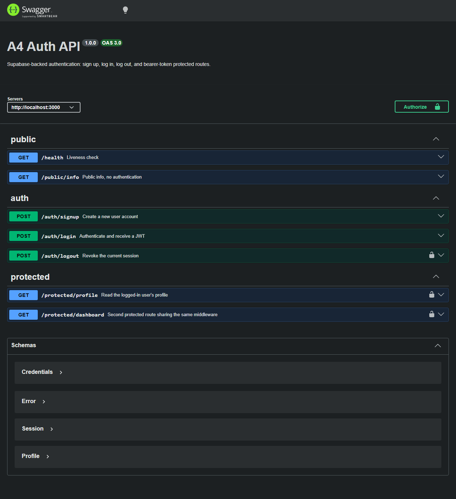

# A4 Auth — Login & Protect

An Express + TypeScript API that uses **Supabase Auth** as its identity
provider. Users sign up and log in through Supabase, get a JWT access token
back, and present that token as `Authorization: Bearer <token>` to reach the
protected routes. The server never stores or hashes passwords itself — it
forwards credentials to Supabase and verifies the tokens Supabase issues.

## How the flow works

```
Client ──(email + password)──► POST /auth/login ──► Supabase Auth
Client ◄──────(access_token JWT)──────────────────────┘

Client ──(Authorization: Bearer <jwt>)──► GET /protected/profile
                                            │
                                 requireAuth middleware
                                            │
                                  supabase.auth.getUser(jwt)
                                            │
                            valid ──► 200 profile    invalid ──► 401
```

## Setup

1. Create a project at [supabase.com](https://supabase.com) and open
   **Project Settings → API** to find the Project URL and the `anon` public key.
2. Copy the env template and fill it in:

   ```bash
   cp .env.example .env
   ```

   ```
   SUPABASE_URL=https://your-project-ref.supabase.co
   SUPABASE_KEY=your_anon_public_key
   PORT=3000
   ```

   `.env` is git-ignored — the keys never leave your machine. The server
   refuses to start if either variable is missing.

3. Install dependencies:

   ```bash
   npm install
   ```

> **Email confirmation:** by default Supabase asks new users to confirm their
> email before they can log in. For local testing, turn
> **Authentication → Sign In / Providers → Confirm email** off, or click the
> link in the confirmation mail before calling `/auth/login`.

## Running it

```bash
npm run dev
```

Or build and run the compiled output:

```bash
npm run build && npm start
```

The server logs `Server running and connected to Supabase (port 3000, ...)`
and serves Swagger UI at <http://localhost:3000/docs>.

## API reference

| Method | Endpoint               | Auth required | Success | Errors |
| ------ | ---------------------- | ------------- | ------- | ------ |
| GET    | `/health`              | No            | `200`   | —      |
| GET    | `/public/info`         | No            | `200`   | —      |
| POST   | `/auth/signup`         | No            | `201`   | `400` missing/rejected credentials |
| POST   | `/auth/login`          | No            | `200`   | `400` missing fields, `401` invalid credentials |
| POST   | `/auth/logout`         | **Yes**       | `204`   | `401` missing/invalid token |
| GET    | `/protected/profile`   | **Yes**       | `200`   | `401` missing/invalid token |
| GET    | `/protected/dashboard` | **Yes**       | `200`   | `401` missing/invalid token |

`401` bodies are `{"error": "Access token required"}` when the header is
missing or malformed, and `{"error": "Invalid or expired token"}` when
Supabase rejects the token.

### Try it with curl

```bash
curl -i -X POST http://localhost:3000/auth/signup \
  -H "Content-Type: application/json" \
  -d '{"email":"test@example.com","password":"password123"}'
```

```bash
curl -i -X POST http://localhost:3000/auth/login \
  -H "Content-Type: application/json" \
  -d '{"email":"test@example.com","password":"password123"}'
```

```bash
curl -i http://localhost:3000/protected/profile \
  -H "Authorization: Bearer <PASTE_ACCESS_TOKEN>"
```

```bash
curl -i -X POST http://localhost:3000/auth/logout \
  -H "Authorization: Bearer <PASTE_ACCESS_TOKEN>"
```

## Swagger UI

Open <http://localhost:3000/docs>, click **Authorize**, paste the
`access_token` from `/auth/login`, and use **Try it out** on any padlocked
route. The raw spec is served at `/openapi.json`.



## Verified against a live Supabase project

Every checkpoint, run end to end against a real project:

```
POST /auth/signup                     -> 201  user created
POST /auth/signup   (no password)     -> 400  email and password are required
POST /auth/login                      -> 200  access_token returned
POST /auth/login    (wrong password)  -> 401  Invalid login credentials
GET  /public/info                     -> 200
GET  /protected/profile (no token)    -> 401  Access token required
GET  /protected/profile (valid token) -> 200  id, email, createdAt, lastSignInAt
GET  /protected/profile (1 char edit) -> 401  Invalid or expired token
GET  /protected/dashboard (valid)     -> 200
GET  /protected/dashboard (tampered)  -> 401  Invalid or expired token
POST /auth/logout   (no token)        -> 401  Access token required
POST /auth/logout   (valid token)     -> 204
GET  /protected/profile (after logout)-> 401  Invalid or expired token
GET  /docs                            -> 200
```

The last line of that run is the one worth pointing at: after `/auth/logout`,
the very same token that worked a moment earlier is rejected, so the session
really was revoked server-side rather than merely forgotten by the client.

## Project layout

```
openapi.json              Hand-written OpenAPI 3 spec (bearerAuth security scheme)
src/
  index.ts                App wiring: json parsing, routers, error handler, listen
  config.ts               Reads and validates SUPABASE_URL / SUPABASE_KEY / PORT
  supabase.ts             Stateless server-side Supabase client
  bearerToken.ts          Parses "Authorization: Bearer <token>" safely
  asyncRoute.ts           Forwards async handler rejections to the error middleware
  types.ts                AuthedRequest + the public shape of a profile
  docs.ts                 Serves Swagger UI at /docs from openapi.json
  middleware/
    requireAuth.ts        The one guard: extract token -> verify -> attach user
  routes/
    publicRoutes.ts       GET /public/info
    authRoutes.ts         POST /auth/signup, /auth/login, /auth/logout
    protectedRoutes.ts    GET /protected/profile, /protected/dashboard
```

## Security notes

- Only the **anon** public key is used. The `service_role` key is never needed
  here and must never be shipped in a client-facing service.
- Passwords are only ever forwarded to Supabase; nothing is logged or stored.
- Token verification is delegated to `supabase.auth.getUser(token)`, so
  expired, tampered, or revoked tokens all fail — the server does not decode
  JWTs itself and does not trust their payload.
- Login failures always return the same generic `Invalid login credentials`
  message, so the endpoint does not reveal which emails are registered.

## AI vs Me (Stage 7 bonus)

After finishing the six stages, I wrote a prompt from memory
([`ai-rematch/PROMPT.md`](ai-rematch/PROMPT.md)) and had an AI assistant
generate the same API from scratch. The result is in
[`ai-rematch/`](ai-rematch/), unedited except for the port, so both servers
can run side by side (mine on 3000, the AI's on 3001) and get hit with the
same requests.

### Token extraction — it handles the happy path, not the shape

The AI's middleware does `authHeader.split(" ")[1]`. That covers the two
obvious cases, and it did check for a missing header and a missing token —
but it never checks the **scheme**. Probing both servers on
`GET /protected/profile`:

| `Authorization` header | Mine | AI version |
| --- | --- | --- |
| *(missing)* | `401 Access token required` | `401 Access token required` |
| `Bearer` | `401 Access token required` | `401 Access token required` |
| `abc123` (no scheme) | `401 Access token required` | `401 Access token required` |
| `Basic abc123` | `401 Access token required` | `401 Invalid or expired token` |
| `bearer abc123` (lowercase) | `401 Invalid or expired token` | `401 Invalid or expired token` |

The `Basic abc123` row is the tell: the AI pulls the Basic-auth credential out
and hands it to Supabase as if it were a JWT. The status code happens to come
out right, but for the wrong reason — a malformed request is reported as a bad
token, and a needless network round-trip is made on every junk header. My
[`bearerToken.ts`](src/bearerToken.ts) rejects a non-bearer scheme before any
network call, and compares the scheme case-insensitively as RFC 7235 requires.

### Security flaws it introduced

1. **Logout doesn't reliably log anyone out.** The AI calls
   `supabase.auth.signOut()` on the shared, module-level client, ignoring the
   token it just verified. In `@supabase/auth-js`, `signOut()` reads the
   session out of the *client's own storage* and only calls the API
   `if (accessToken)` — and because `persistSession` defaults to `true` and
   falls back to a process-wide memory adapter in Node, that storage holds
   whichever user logged in through this server last. So logout either revokes
   nothing (returning a cheerful `204`) or revokes a **different user's**
   session. Mine disables session persistence and passes the caller's own
   verified token explicitly.

   Measured against the live project — log in through my server, then hand the
   token to the AI server's logout:

   ```
   1. token works before any logout
      mine /protected/profile: 200
   2. call the AI server's logout with that token
      ai /auth/logout: 204
   3. is the session actually revoked?
      mine /protected/profile: 200   <- STILL VALID
   4. now log out through my server with the same token
      mine /auth/logout: 204
      mine /protected/profile: 401 Invalid or expired token
   ```

   The AI server answered `204 No Content` — the exact status the assignment
   asks for — while leaving the session fully usable. A test that only checks
   status codes passes it.
2. **No validation of input types or emptiness.** `if (!email || !password)`
   lets `"   "` and non-strings like `1` / `true` through to the SDK. With a
   real project those become Supabase's problem; the boundary is simply not
   guarded.
3. **No env validation.** With no `.env` present, it dies on startup with
   `Error: supabaseUrl is required.` from inside `node_modules`. Mine fails
   with a message naming the variable and pointing at `.env.example`.
4. **Unhandled async errors.** No route has a `try`/`catch` and the app has no
   error middleware, so any rejection inside an `async` handler becomes an
   unhandled promise rejection. `data.session.access_token` in the login route
   is the concrete landmine: Supabase can return a user with no session (email
   confirmation pending), which throws a `TypeError` and, on Node 24, takes
   the process down. Mine wraps async handlers in
   [`asyncRoute`](src/asyncRoute.ts) and checks `!data.session`.

### What my prompt missed, and what the AI assumed

- **What I forgot to ask for:** env validation, error handling for anything
  other than the auth failures I enumerated, a second protected route to prove
  the middleware is reusable, `/health`, and TypeScript. The AI gave me exactly
  the endpoints I listed and nothing beyond them — every requirement I didn't
  state is a requirement that didn't get built.
- **What it assumed:** plain JavaScript in a single 100-line `server.js`,
  `PORT || 3001`, `req.user` as the way to pass the verified user down, and —
  most importantly — that "sign the user out" means calling `signOut()` with
  no arguments. That last one reads perfectly plausibly; you only catch it by
  knowing the SDK stores session state on the client.
- **The pattern:** it got every status code I named right (`201`, `200`,
  `400`, `401`, `204`) and reproduced my exact error strings. Correctness on
  the paths I described, silence on everything else. Explicit instructions
  produce explicit results; the gaps in the prompt become gaps in the code,
  and the security-relevant gaps are the ones that don't announce themselves
  in testing.
